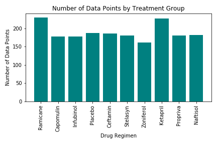

# Pymaceuticals
-------------------------
## Project Overview
-------------------------
The goal of this project was to analyze the impact of drug treatment on tumor volume using the Pandas Library and the Jupyter Notebook and Matplotlib.

* Generate a summary statistics table consisting of the mean, median, variance, standard deviation, and SEM of the tumor volume for each drug regimen.

* Generate a bar plot using both Pandas's `DataFrame.plot()` and Matplotlib's `pyplot` that shows the number of data points for each treatment regimen.

* Generate a pie plot using both Pandas's `DataFrame.plot()` and Matplotlib's `pyplot` that shows the distribution of female or male mice in the study.

* Calculate the final tumor volume of each mouse across four of the most promising treatment regimens: Capomulin, Ramicane, Infubinol, and Ceftamin. Calculate the quartiles and IQR and quantitatively determine if there are any potential outliers across all four treatment regimens.

* Using Matplotlib, generate a box and whisker plot of the final tumor volume for all four treatment regimens and highlight any potential outliers in the plot by changing their color and style.

* Generate a line plot of time point versus tumor volume for a single mouse treated with Capomulin.

* Generate a scatter plot of mouse weight versus average tumor volume for the Capomulin treatment regimen.

* Calculate the correlation coefficient and linear regression model between mouse weight and average tumor volume for the Capomulin treatment. Plot the linear regression model on top of the previous scatter plot.

* Look across all previously generated figures and tables and write at least three observations or inferences that can be made from the data. Include these observations at the top of notebook.

Summary

1. The final tumor volume analysis of Capomulin, Ramicane, Infubinol, and Placebo reveals that Capomulin and Ramicane are far more effective than Infubinol and Placebo in reducing tumor volume over time. 
2. Mice treated with Capomulin had a 48% reduction in tumor volume over 45 days. 
3. Mouse Weight may be a confounding variable in this research. Mouse Weight has a strong positive correlation with Tumor Volume.  

